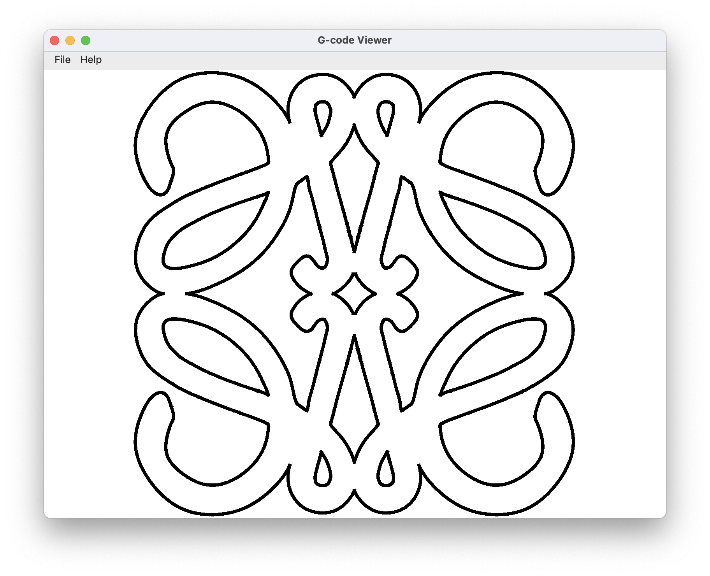

# G-code Viewer 2D
A Python based G-code viewer for 2D contours. It only plots data from the x,y-plane.

## Features

- Plot 2D contours of G-code
- Qt (Pyside6) based GUI
- Plot a raster
- Plot outline and dimensions

## Requirements

- Python 3 (any version which works with Pyside6)
- Pyside6 (Qt for Python)

## GUI




## Usage

Start the program GUI. Later use the menu ```File/Open``` to load and plot a G-code.

```sh
python GCODE_Viewer_2d.py
```

The command below directly opens and plots the given file immediately.

```sh
python GCODE_Viewer_2d.py any_gcode_file.nc
```

When clicking the right mouse button a context menu opens, and raster as well as outline can be toggled on/off. The default raster size is 10mm and it can be redefined through the context menu.

### Command Line Arguments

None or a G-code file (see above).